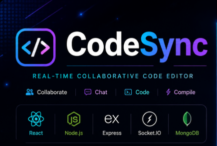
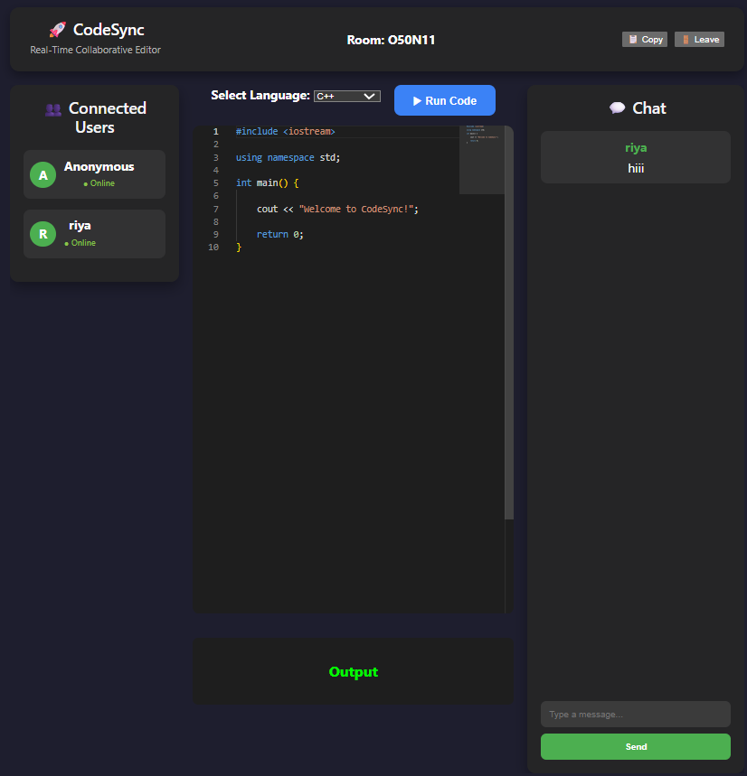
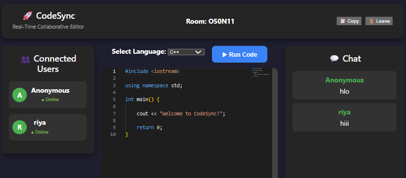
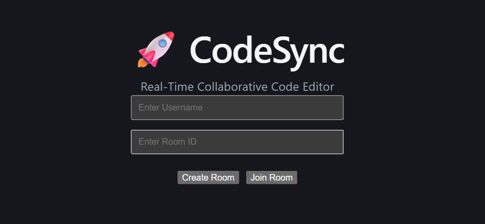

<div align="center">
  
</div>

<p align="center">
  
  
  
  
</p>

##   🚀 About CodeSync

CodeSync is a full-stack real-time collaborative code editor that enables multiple developers to create secure rooms, write code together, communicate through live chat, and execute code from a shared workspace. It demonstrates real-time communication using Socket.IO and follows the MERN stack architecture.

Built using **React, Node.js, Express, Socket.IO and MongoDB**.

</div>

---

<div align="center">


</div>

> A real-time collaborative code editor built using the MERN Stack, allowing multiple users to write code together, communicate through live chat, and collaborate seamlessly.

---

## 📌 Features

- 👥 Create and Join Collaboration Rooms
- 💻 Real-time Collaborative Code Editor
- 💬 Live Chat using Socket.IO
- 👨‍💻 Multiple Users in the Same Room
- ✨ Syntax Highlighting
- 📋 Copy Room ID
- 🚪 Leave Room Functionality
- 🔐 JWT Authentication
- 🗄 MongoDB Database Integration
- ⚡ Real-time Code Synchronization
- ▶️ Code Execution
- 📁 File Upload Support
- 📱 Responsive User Interface

---

## 🛠️ Tech Stack

| Category | Technologies |
|----------|--------------|
| Frontend | React, Vite, HTML, CSS, JavaScript |
| Backend | Node.js, Express.js |
| Database | MongoDB |
| Real-Time | Socket.IO |
| Authentication | JWT |
| Version Control | Git, GitHub |

---

## 📂 Project Structure

```text
CodeSync/
├── client/
│   ├── public/
│   ├── src/
│   └── package.json
│
├── server/
│   ├── controllers/
│   ├── models/
│   ├── routes/
│   ├── middleware/
│   ├── sockets/
│   └── package.json
│
├── .gitignore
└── README.md
```

---

## ⚙️ Installation

### Clone Repository

```bash
git clone https://github.com/Harsh-128/CodeSync.git
```

```bash
cd CodeSync
```

### Install Client

```bash
cd client
npm install
```

### Install Server

```bash
cd ../server
npm install
```

### Configure Environment Variables

Create a `.env` file inside the `server` folder.

```env
PORT=5000
MONGO_URI=your_mongodb_connection_string
JWT_SECRET=your_secret_key
```

### Start Backend

```bash
cd server
npm run dev
```

### Start Frontend

```bash
cd client
npm start
```

---

## 📸 Project Screenshots

### 🏠 Home Page



---

### 🚪 Create / Join Room



---

### 💬 Live Chat



---

## 🚀 Future Improvements

- Voice Chat
- Video Calling
- AI Code Suggestions
- Collaborative Whiteboard
- Multiple Programming Languages
- Theme Customization

---

## 👨‍💻 Author

**Harsh Sharma**

- GitHub: https://github.com/Harsh-128

---

## ⭐ Support

If you like this project, please give it a ⭐ on GitHub.
