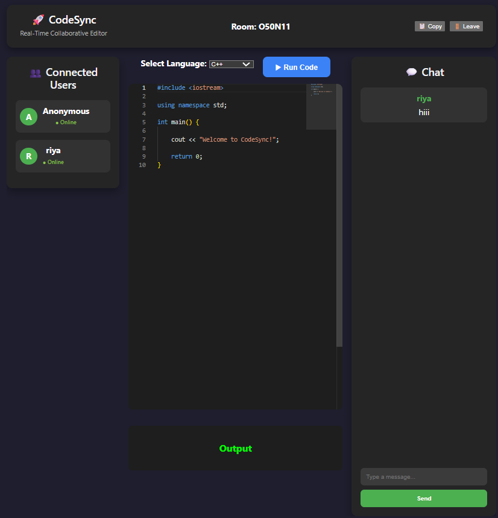
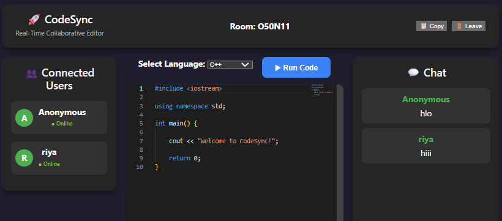
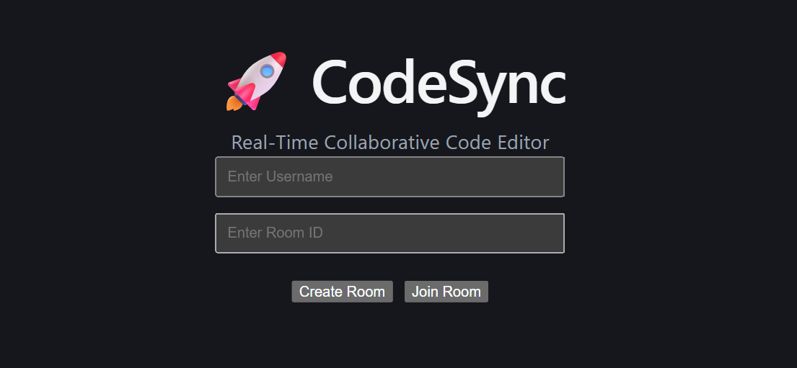

<div align="center">


# CodeSync

### Real-Time Collaborative Code Editor

**[🔗 Live Demo](https://code-sync-jnzj.vercel.app)** &nbsp;·&nbsp; **[� Backend API](https://codesync-backend-gur0.onrender.com/api/health)** &nbsp;·&nbsp; **[📦 GitHub](https://github.com/Harsh-128/CodeSync)**

<p>
  
  
  
  
</p>

<p>
  
  
  
  
  
  
  
</p>

</div>

---

## � What is CodeSync?

CodeSync is a **full-stack real-time collaborative code editor** built with the MERN stack. Multiple developers can join the same room, write code together, see each other's live cursors, chat, and execute code — all in the browser without any installation.

Think of it as a lightweight **Google Docs for code**, with a built-in code runner.

---

## �🚀 Live Demo

> **Try it → [https://code-sync-jnzj.vercel.app](https://code-sync-jnzj.vercel.app)**

1. Sign up for a free account
2. Create a room — get a unique Room ID
3. Share the room link with a friend
4. Code together in real time!

> ⚠️ Backend runs on Render free tier — first load after inactivity may take ~30 seconds to wake up.

---

## ✨ Features

### Core
| Feature | Description |
|---|---|
| ⚡ **Real-time Code Sync** | Every keystroke syncs instantly to all collaborators via WebSockets |
| 🖱️ **Live Cursor Presence** | See every collaborator's cursor with a unique colored name label |
| 💬 **Live Chat** | Built-in chat panel with Enter-to-send, auto-scroll to latest message |
| ▶️ **Code Execution** | Run C++, Python, JavaScript, Java directly in the browser |
| � **User Presence** | See who's online in the room in real time |

### Auth & Security
| Feature | Description |
|---|---|
| 🔐 **JWT Authentication** | Signup/Login with bcrypt password hashing, 7-day token expiry |
| 🛡️ **JWT Middleware** | All protected routes verified server-side — unauthorized requests get 401 |
| 🔒 **Secure by Default** | `crypto.randomBytes` for room IDs, input validation on all endpoints |

### Editor
| Feature | Description |
|---|---|
| 🎨 **Monaco Editor** | VS Code's editor in the browser — syntax highlighting, bracket pairs, IntelliSense |
| 🌙 **Multiple Themes** | VS Dark, VS Light, High Contrast |
| 📝 **4 Languages** | C++ (17/20), Python 3, JavaScript (Node.js), Java 21 |
| � **Local Persistence** | Code saved to localStorage per room + language |

### UX
| Feature | Description |
|---|---|
| 🖥️ **VS Code Layout** | Full-screen IDE layout — no page scroll, everything visible |
| 📥 **Custom Input (stdin)** | Provide program input before running — side by side with output |
| 📜 **Room History** | Profile page shows all rooms joined with rejoin button |
| 🔗 **Invite Links** | One-click copy of room link — friends join directly |

---

## 🛠️ Tech Stack

### Frontend
| Technology | Version | Purpose |
|---|---|---|
| React | 19 | UI framework |
| Vite | 8 | Build tool & dev server |
| Monaco Editor | `@monaco-editor/react` | Code editor (VS Code engine) |
| Socket.IO Client | 4 | Real-time WebSocket communication |
| React Router | 7 | Client-side routing |
| Axios | 1.x | HTTP requests with JWT interceptor |
| react-hot-toast | 2 | Toast notifications |

### Backend
| Technology | Version | Purpose |
|---|---|---|
| Node.js | 22 | Runtime |
| Express | 5 | Web framework |
| Socket.IO | 4 | WebSocket server for real-time events |
| Mongoose | 9 | MongoDB ODM |
| jsonwebtoken | 9 | JWT generation & verification |
| bcryptjs | 3 | Password hashing |
| child_process | built-in | Code execution via local compilers |

### Database & Storage
| Technology | Purpose |
|---|---|
| MongoDB Atlas | Cloud database — users, rooms, room history |
| localStorage | Per-browser code & recent rooms cache |

### DevOps & Deployment
| Technology | Purpose |
|---|---|
| Docker | Containerizes backend with g++, Python 3, Java pre-installed |
| Render | Hosts backend Docker container (free tier) |
| Vercel | Hosts React frontend (free tier) |
| MongoDB Atlas | Cloud MongoDB M0 free cluster (AWS Mumbai) |
| GitHub | Source control + auto-deploy trigger for both Render and Vercel |

---

## 🏗️ Architecture

```
Browser (React + Vite)
    │
    ├── HTTP (Axios + JWT)  ──────────────►  Express REST API
    │                                             │
    └── WebSocket (Socket.IO) ──────────────►  Socket.IO Server
                                                  │
                                            ┌─────┴──────┐
                                            │            │
                                       MongoDB        Code Execution
                                       Atlas          (child_process)
                                                      g++ / python3
                                                      node / java
```

### Socket.IO Events
| Event | Direction | Description |
|---|---|---|
| `join-room` | Client → Server | User joins a room |
| `users-update` | Server → Room | Updated list of connected users |
| `code-change` | Client → Server | Editor content changed |
| `code-update` | Server → Others | Broadcast code to other users |
| `cursor-move` | Client → Server | Cursor position changed |
| `cursor-update` | Server → Others | Broadcast cursor to others |
| `cursor-remove` | Server → Others | User disconnected, remove cursor |
| `send-message` | Client → Server | Chat message sent |
| `receive-message` | Server → Room | Broadcast message to room |

---

## 📂 Project Structure

```
CodeSync/
│
├── client/                          # React + Vite frontend
│   ├── src/
│   │   ├── components/
│   │   │   ├── CodeEditor.jsx       # Monaco editor + live cursors
│   │   │   ├── ChatPanel.jsx        # Real-time chat
│   │   │   ├── UsersPanel.jsx       # Connected users list
│   │   │   ├── Navbar.jsx           # Room navbar
│   │   │   ├── ProtectedRoute.jsx   # Auth guard
│   │   │   └── RoomEntry.jsx        # Login gate for room URLs
│   │   ├── pages/
│   │   │   ├── Home.jsx             # Landing page
│   │   │   ├── Room.jsx             # Main editor room
│   │   │   ├── Login.jsx            # Login page
│   │   │   ├── Signup.jsx           # Signup page
│   │   │   └── Profile.jsx          # Profile + room history
│   │   ├── services/
│   │   │   ├── api.js               # Axios instance + JWT interceptor
│   │   │   └── auth.js              # Login/signup helpers
│   │   └── styles/
│   │       ├── room.css             # IDE layout styles
│   │       ├── auth.css             # Login/Signup styles
│   │       └── profile.css          # Profile page styles
│   └── package.json
│
└── server/                          # Node.js + Express backend
    ├── middleware/
    │   └── authMiddleware.js        # JWT verification middleware
    ├── controllers/
    │   ├── authController.js        # Signup, Login
    │   ├── roomController.js        # CRUD for rooms
    │   ├── codeController.js        # Code execution engine
    │   └── roomHistoryController.js # Room visit history
    ├── models/
    │   ├── User.js                  # User schema
    │   ├── Room.js                  # Room schema
    │   └── RoomHistory.js           # History schema
    ├── routes/
    │   ├── authRoutes.js            # /auth/signup, /auth/login
    │   ├── roomRoutes.js            # /rooms/* (protected)
    │   ├── codeRoutes.js            # /code/run (protected)
    │   └── roomHistoryRoutes.js     # /room-history/* (protected)
    ├── socket/
    │   └── socketHandler.js        # All Socket.IO event handlers
    ├── config/
    │   └── db.js                   # MongoDB connection
    ├── Dockerfile                  # Docker with compilers
    └── package.json
```

---

## ⚙️ Local Setup

### Prerequisites
- Node.js 18+
- MongoDB (local) or MongoDB Atlas URI
- g++ with C++17 support
- Python 3
- Java JDK 11+

### 1. Clone the repo
```bash
git clone https://github.com/Harsh-128/CodeSync.git
cd CodeSync
```

### 2. Install dependencies
```bash
# Backend
cd server && npm install

# Frontend
cd ../client && npm install
```

### 3. Configure environment
Create `server/.env` (copy from `server/.env.example`):
```env
MONGO_URI=mongodb://127.0.0.1:27017/codesync
JWT_SECRET=your_long_random_secret_here
PORT=3000
CLIENT_URL=http://localhost:5173
```

### 4. Run locally
```bash
# Terminal 1 — Backend (port 3000)
cd server && npm run dev

# Terminal 2 — Frontend (port 5173)
cd client && npm run dev
```

Open **http://localhost:5173**

### 5. Run with Docker (optional)
```bash
docker-compose up --build
```

---

## 🚢 Deployment

| Service | URL | Purpose |
|---|---|---|
| **Vercel** | https://code-sync-jnzj.vercel.app | Frontend |
| **Render** | https://codesync-backend-gur0.onrender.com | Backend (Docker) |
| **MongoDB Atlas** | AWS Mumbai (ap-south-1) | Database |

### Environment Variables on Render
```
MONGO_URI      = mongodb+srv://...
JWT_SECRET     = <long random string>
PORT           = 3000
CLIENT_URL     = https://code-sync-jnzj.vercel.app
```

### Environment Variables on Vercel
```
VITE_BACKEND_URL = https://codesync-backend-gur0.onrender.com
```

---

## 📸 Screenshots

### 🏠 Home Page


### 🚪 Room — Live Collaboration


### 💬 Chat


---

## � Security

- Passwords hashed with **bcryptjs** (salt rounds: 10)
- JWT tokens expire after **7 days**
- All protected routes verified server-side with **JWT middleware**
- Room IDs generated with **crypto.randomBytes** (collision-safe)
- Input validation on all auth endpoints
- CORS restricted to known frontend origins
- Code execution sandboxed with **10-second timeout** + **500KB output limit**

---

## 🚀 Future Improvements

- [ ] Room code persistence in MongoDB (survive browser refresh)
- [ ] Operational Transform / CRDT for conflict-free concurrent edits
- [ ] Room password protection
- [ ] GitHub OAuth login
- [ ] Voice chat integration
- [ ] AI code suggestions (Copilot-style)
- [ ] Mobile responsive room editor

---

## �👨‍💻 Author

**Harsh Sharma**
- GitHub: [@Harsh-128](https://github.com/Harsh-128)

---

<div align="center">

If you found this useful, give it a ⭐ on GitHub!

**[⭐ Star on GitHub](https://github.com/Harsh-128/CodeSync)**

</div>
